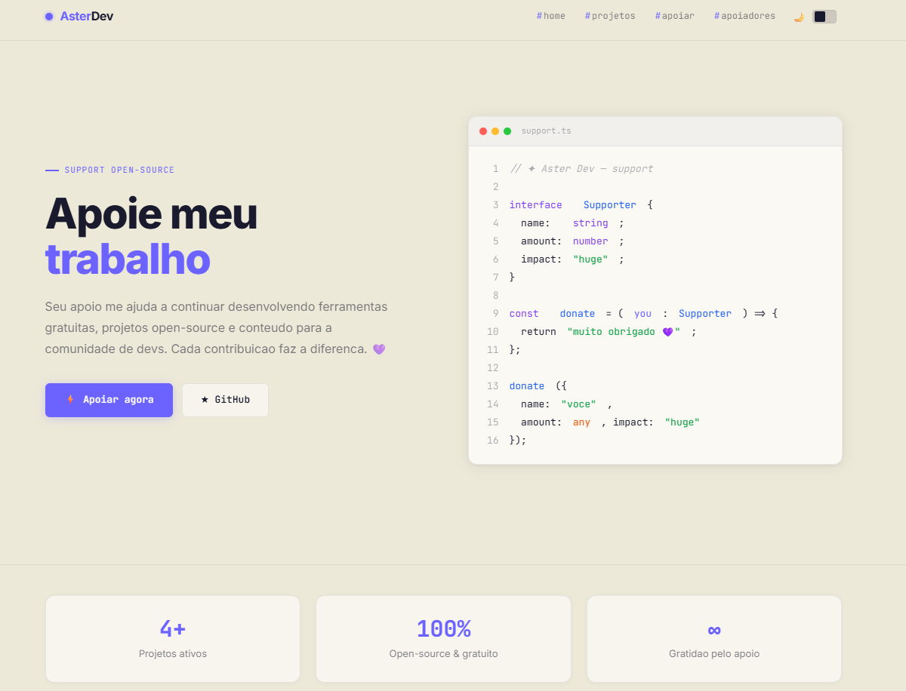
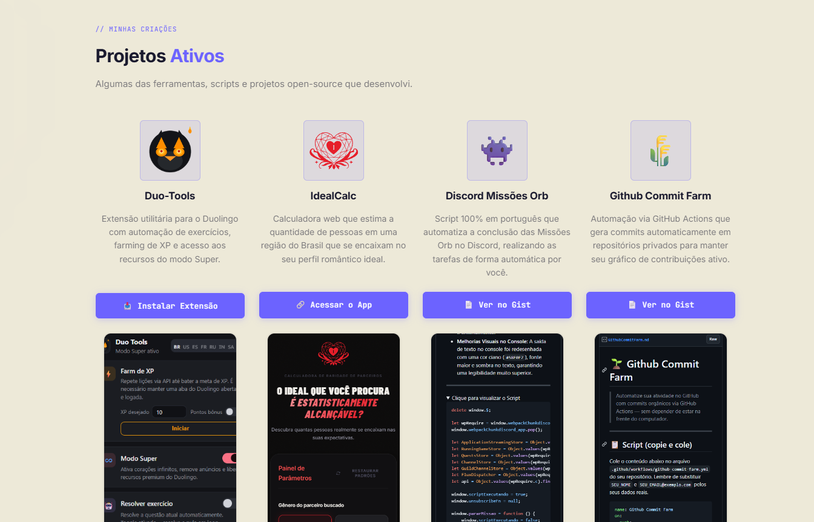
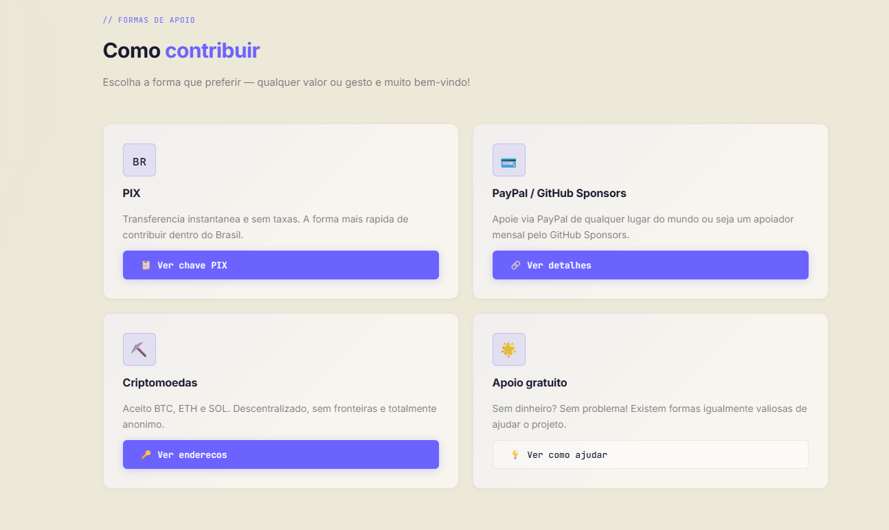

# Aster Dev · Donate & Portfolio



Uma landing page moderna, rápida e responsiva criada para centralizar os meus projetos open-source e facilitar o apoio/doação ao meu trabalho. Foi desenvolvida totalmente do zero com HTML, CSS e JavaScript puro (Vanilla), focando em usabilidade, responsividade e um design premium.

## 🚀 Projetos em Destaque



A página conta com um grid de mockups e um carrossel infinito responsivo para as ferramentas que desenvolvi:
- **Duo-Tools:** Extensão utilitária para o Duolingo com automação de exercícios, farming de XP e modo Super.
- **IdealCalc:** Calculadora web que estima estatisticamente seu perfil romântico no Brasil.
- **Discord Missões Orb:** Script em português para automação de missões e orbs no Discord.
- **Github Commit Farm:** Script de GitHub Actions para gerar commits automáticos em repositórios privados.

## ☕ Apoie meu Trabalho



A plataforma conta com uma interface clean e direta para recebimento de apoios, com painéis deslizantes (Accordion/Modals):
- **Pix:** Sistema de "copia e cola" direto para a área de transferência com toast interativo.
- **Criptomoedas:** Suporte a Bitcoin, Ethereum, Solana e Litecoin, com geração em tempo real do QR Code de cada rede.

## 🎨 Recursos Técnicos

- **Dark Mode Nativo:** Alternância suave entre os temas claro e escuro salvos no cache.
- **Vanilla Setup:** Zero dependências (Sem React, sem Tailwind). Código ultra-leve usando CSS custom variables, Flexbox e Grid.
- **UX/UI Refinada:** Micro-interações, efeitos Glassmorphism, animações suaves e tooltips responsivas perfeitamente adaptadas para iOS e Android.
- **Carrossel Customizado:** Lógica de rolagem infinita invisível construída puramente em Javascript para contornar limitações nativas do CSS em dispositivos móveis.

## 🛠️ Como Executar

Por utilizar a API `fetch()` para o sistema de internacionalização (i18n), o projeto precisa ser executado através de um servidor web local para evitar bloqueios de CORS (Cross-Origin Resource Sharing) no navegador.

1. Clone o repositório:
```bash
git clone https://github.com/seu-usuario/donate-page.git
cd donate-page
```
2. Abra a pasta em um editor como o VSCode.
3. Utilize a extensão **Live Server** (ou rode `npx serve`) para abrir o `index.html`. O projeto não funcionará corretamente se você apenas clicar duas vezes no arquivo `index.html` (protocolo `file:///`).

---
**Desenvolvido com dedicação por Aster.**
